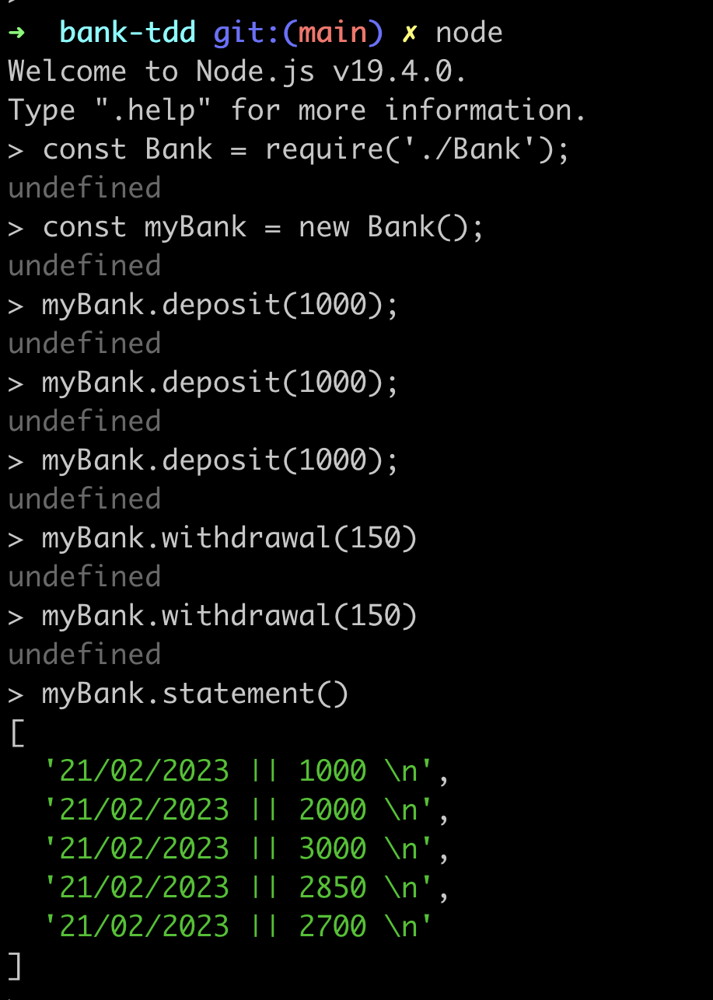

# 1. to run the tests run jest on the terminal

# 2. My approach for this program was create 2 classes:
GetDate class  => that handles the date format
Bank clASS => That uses the getDate class to display to the user the current date after doing a bank operation.

I decide to structure my approach in this way so the responsabilite of my classes are splited in 2. Bank operations and set the date.

# 3. this is how I started my program:
  on the terminal:
  % nvm use node

  % npm install -g jest esbuild

  % npm init -y

  % touch Bank.js

  % touch Bank.test.js

  %  touch GetDate.js

  %  touch GetDate.test.js

  

